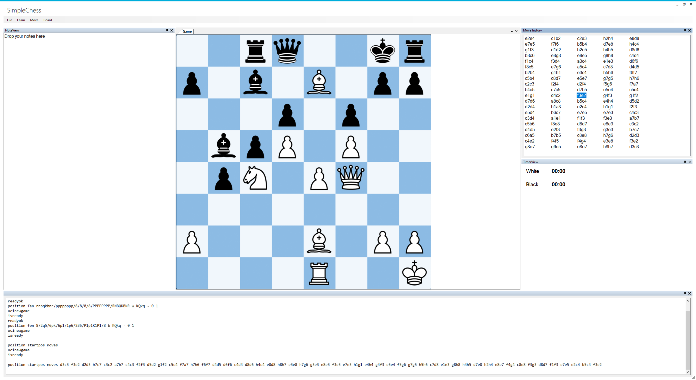

# Welcome to SimpleChess!

SimpleChess is a GUI Frontend for UCI Chess engines

# How does it look?
```

```

# Current state

SimpleChess is in very early development stage. So it is currently only possible to play white. 

# What you can already do with it?
- Play chess! Only with white, but it's playable.
- Load PGN files and view the match
- Undo moves
- Save and reload your match


# Running
Currently the stockfish engine is hardcoded.

Checkout the sources, compile and put your stockfish.exe in the output directory
